## Name

Private School System with Database

## Description

~ Java SE Application ~\
A Private School System Simulator with a Database where following are implemented:\
\
&emsp;&#8226;&emsp;A design of application's ERD\
\
&emsp;&#8226;&emsp;A design of application's ERD's schema\
\
&emsp;&#8226;&emsp;SQL query that shows a list of all the students\
\
&emsp;&#8226;&emsp;SQL query that shows a list of all the trainers\
\
&emsp;&#8226;&emsp;SQL query that shows a list of all the assignments\
\
&emsp;&#8226;&emsp;SQL query that shows a list of all the courses\
\
&emsp;&#8226;&emsp;SQL query that shows a list of all the students per course\
\
&emsp;&#8226;&emsp;SQL query that shows a list of all the trainers per course\
\
&emsp;&#8226;&emsp;SQL query that shows a list of all the assignments per course\
\
&emsp;&#8226;&emsp;SQL query that shows a list of all the assignments per course per student\
\
&emsp;&#8226;&emsp;SQL query that shows a list of a list of students that belong to more than one courses\
\
&emsp;&#8226;&emsp;Application options after connecting to database:\
\
&emsp;&emsp;&#8226;&emsp;Prints of above queries\
\
&emsp;&emsp;&#8226;&emsp;Insert data to students table\
\
&emsp;&emsp;&#8226;&emsp;Insert data to trainers table\
\
&emsp;&emsp;&#8226;&emsp;Insert data to assignments table\
\
&emsp;&emsp;&#8226;&emsp;Insert data to courses table\
\
&emsp;&emsp;&#8226;&emsp;Associate student with course\
\
&emsp;&emsp;&#8226;&emsp;Associate trainer with course\
\
&emsp;&emsp;&#8226;&emsp;Associate student with course's assignment\

Syntetic data are kept in database in case user doesn't want to provide any.

## Demonstration

***First of all you need to provide a database username and password on <ins>src/models/DatabaseConnection.java</ins> file, on variables 'USERNAME' and 'PASSWORD'***

Starting the application, user will be asked if he/she wants to add/associate data to/from database or proceed to presentation with only the syntetic data.

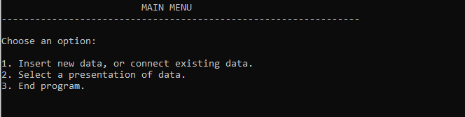

#### Choosing to insert/associate data

User will see a menu with all data insertions or data associations possible to choose from.

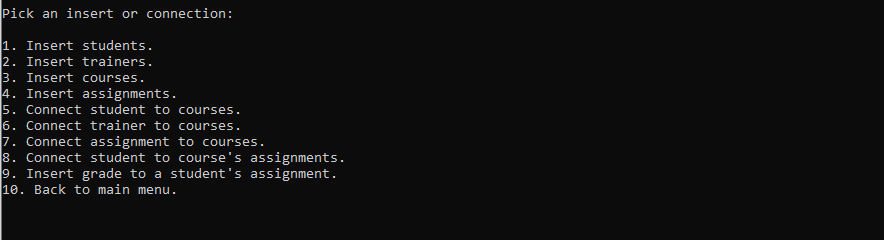

##### Option 1: Insert students.

##### Option 2: Insert trainers. ,
##### Option 3: Insert assignments. ,
##### Option 4: Insert courses.

The procedure is the same for these options as above. User is asked to provide some information before insertion, as he/she did with student.

##### Option 5: Connect student to courses.

Picking option no.5, user must choose first from a list of students

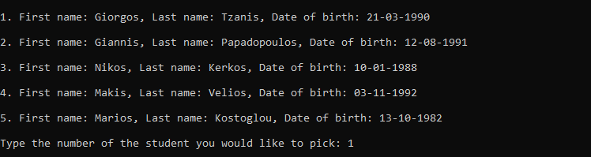

and then from a list of courses, to insert the association between them to database.

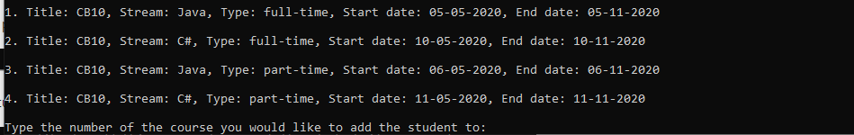

After the association is completed, user is asked to add tuition fees of student's enrollment to course.

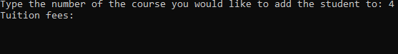

If everything is valid the insertion is done and user is asked if he/she wants to associate this student with another course.

If not, the validation error is being displayed and user is asked if he/she wants to associate this student with another course.

##### Option 6: Connect trainer to courses. ,
##### Option 7: Connect assignment to courses.

The procedure is the same for these options as above. User is asked to pick from 2 lists to make the association, with the only exceptions being that trainer-course has no extra step and assignment-course connection asks user for assignment's submission date.

##### Option 8: Connect student to course's assignments.

In this option after user has picked a student and a course he has enrolled to, is asked if he/she wants to add all of course's assignments to this student.

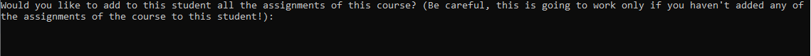

If not, he/she is given the course's assignments to pick from.

##### Option 9: Insert grade to a student's assignment.

User is capable of providing a grade for a student's assignment after picking a student, a course that student has enrolled to and an assignmet he has been given from the course.

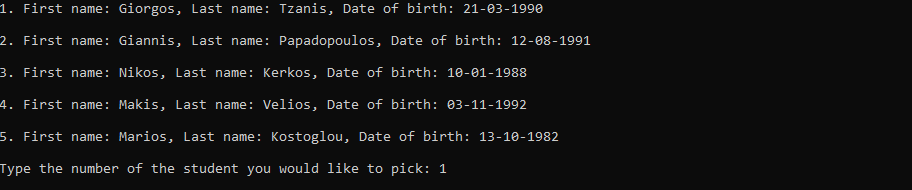
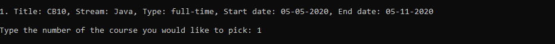
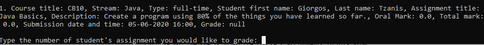

##### Option 10: Back to main menu.

User redirects to main menu.

#### Selecting data presentation

##### Option 1: Students.

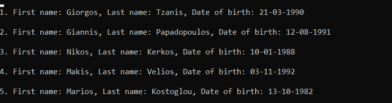

##### Option 2: Trainers.

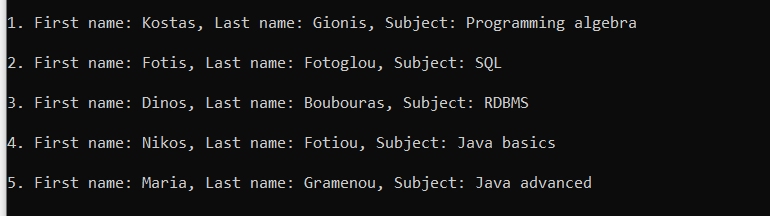

##### Option 3: Courses.

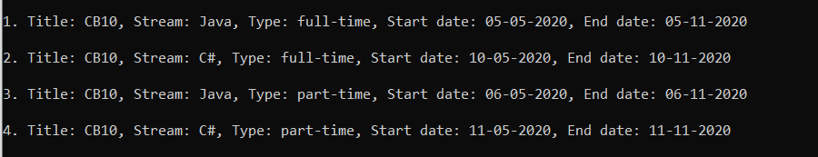

##### Option 4: Assignments.

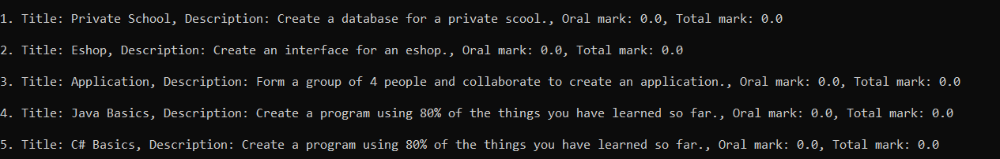

##### Option 5: Students per course.

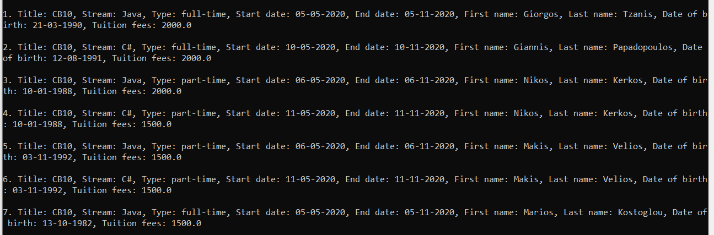

##### Option 6: Trainers per course.

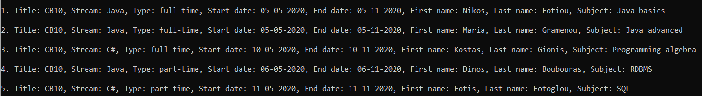

##### Option 7: Assignments per course.

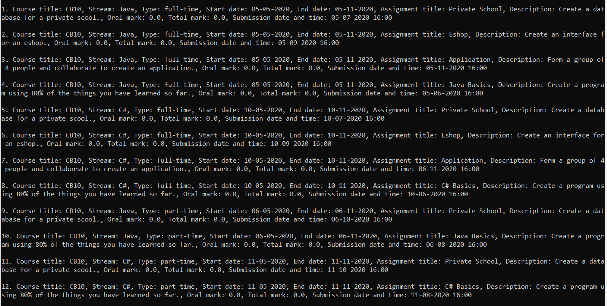

##### Option 8: Assignments per student per course.

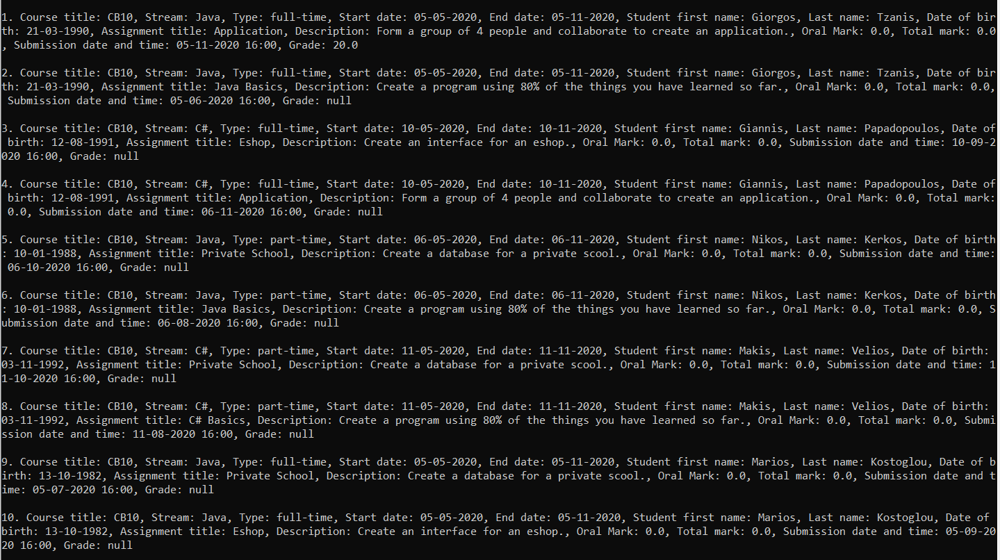

##### Option 9: Students enrolled to more than one courses.

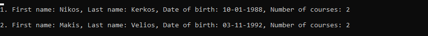

##### Option 10: Back to main menu.

User redirects to main menu.

## Technology & Tools

<a href="https://www.java.com/en/download/">Java 8</a>  
<a href="https://netbeans.org/">Apache NetBeans IDE</a>  
<a href="https://www.mysql.com/">MySQL</a>
<a href="https://docs.oracle.com/javase/8/docs/technotes/guides/jdbc/">Java JDBC API</a>
